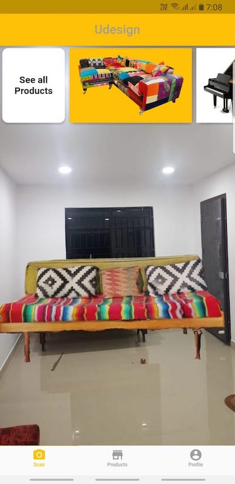
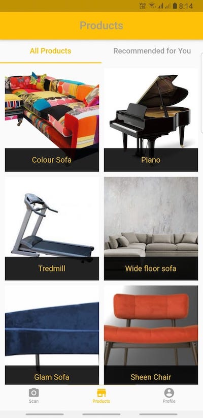
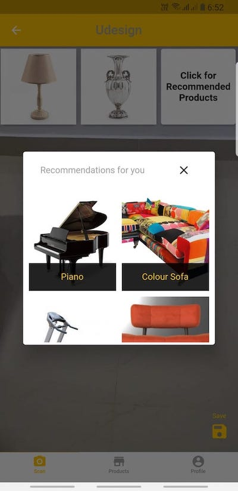
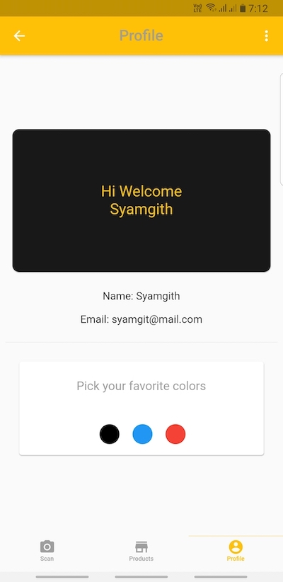
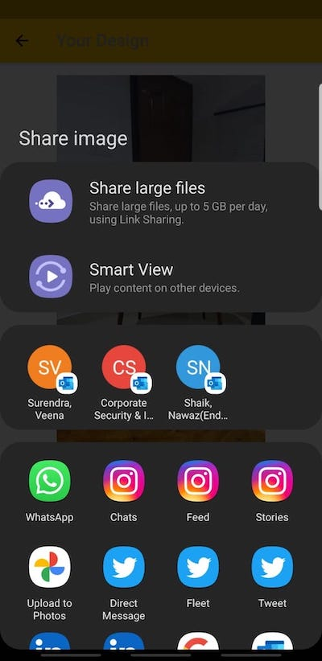

Note: We encourage you to fork and use this project as a foundation for your own augmented reality or virtual reality applications. Feel free to modify the app or use it as a template to integrate its functionality into your project. Open-source contributions are always welcome. Thank you for your support! 
# UDESIGN
## Augmented Reality interior design appication.  
### An augmented reality app that helps you decorate your home interiors and design rooms to match your personal style.
### Before buying the products, view them in ur room and see how they fit and look.  
### Personal profile login, save and share and much more.  

****
Check out [Udesign Download APK](Udesign-v1.apk)
****

****
